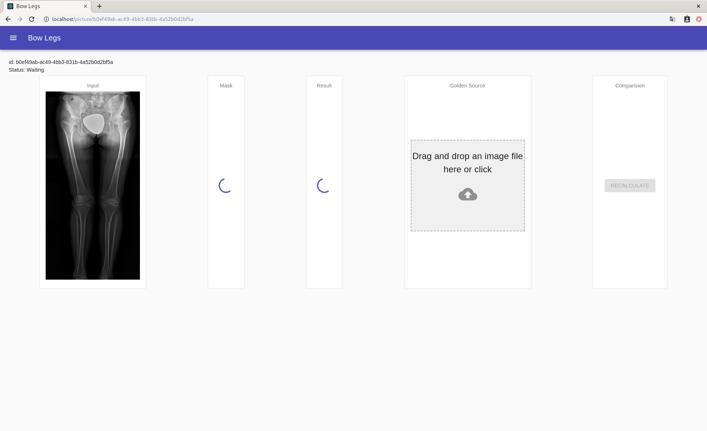
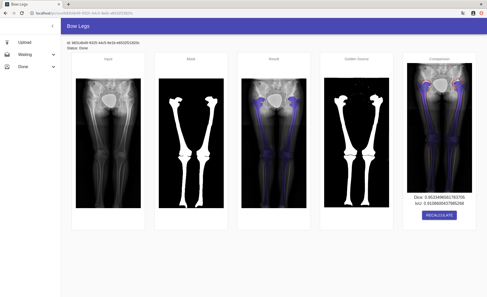
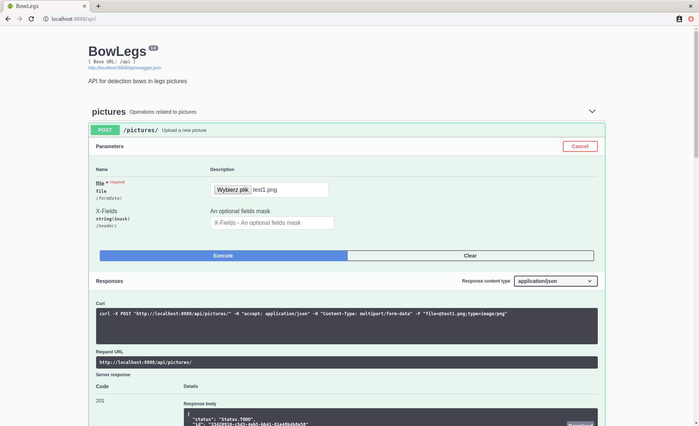

# BowLegs

BowLegs in an web application to mark bones in legs pictures.

Project was created by Radomir Krawczykiewicz and Marek Świątek for Computer Vision course at AGH.

## Run system

To start system please run:
```
docker-compose up -d
docker-compose scale worker=3
```

Then access UI on localhost:80

And backend Swagger UI on localhost:8080/api

## Architecture


System is divided in few micro-services:
* Kafka, which provide scalable queue and connect workers with backend.
To communication of our python micro-services with Kafka we used kafka-python
* Database, were we store information about legs pictures. We used SQLAlchemy to communicate with database.
Be default we are using SQLite, but user can easily change it to another database like PostgreSQL
* Ml worker takes task from Kafka and then process specific images. It is using keras with tensorflow for machine learning prediction.
* UI, which is Single Page created in React and enables user to interact with system. 
* Rest backend is created in flask.

One can scale each of microservices, however the most important one to scale is ML worker.

## Examples

By default user will see upload screen:


On this screen user can select picture from his file system and see its preview:


User can upload selected image to the server and he will be returned with id:


Pictures are processing by workers asynchronously:


When work will be finished, user will be able to see result:


User can choose his golden source version and then compare it with results provided by machine. There are two scores present:
* Dice - Dice Similarity Coefficient for ground truth and predicted masks.
* IoU - Intersection over Union score for ground truth and predicted masks.



User can upload multiple files, which will be added to waiting queue:


One can also use swagger to better understand backend API:

